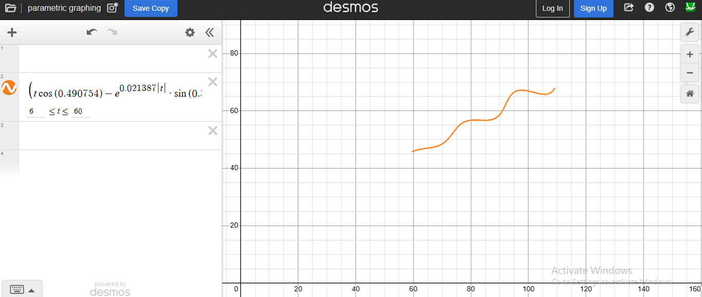

# Computation Results

**Theta (degrees):** 28.118109
**M:** 0.021387
**X:** 54.899655
**L1:** 37865.094190

---

## LaTeX Representation

```
\left(t\cos(0.490754)-e^{0.021387\left|t\right|}\cdot\sin(0.3t)\sin(0.490754)+54.899655,\,42+t\sin(0.490754)+e^{0.021387\left|t\right|}\cdot\sin(0.3t)\cos(0.490754)\right)
```

---
## Visualization



---

## Notes

* Parameters are derived based on the given equations.
* The LaTeX expression can be used directly in mathematical documents or plotted.

---
